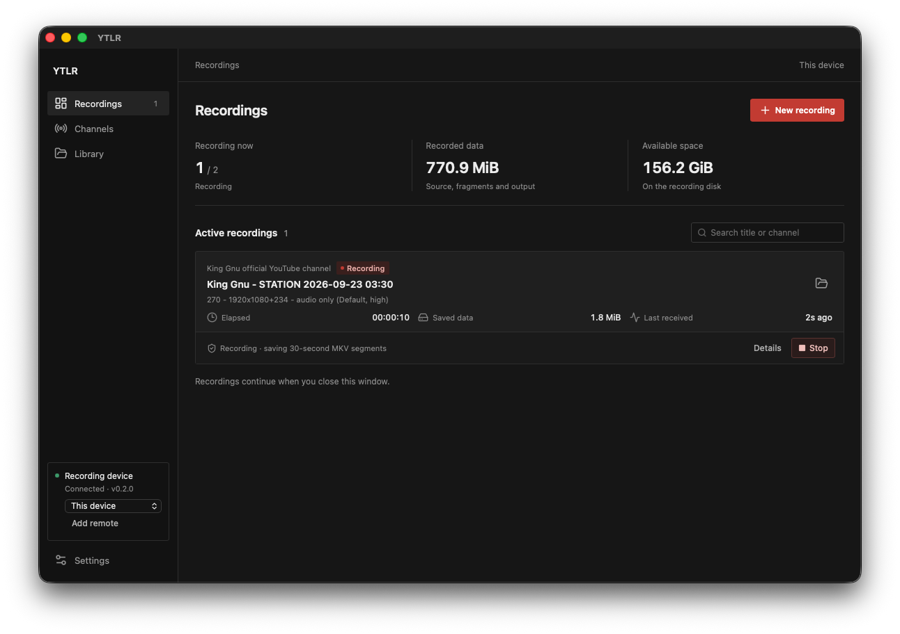
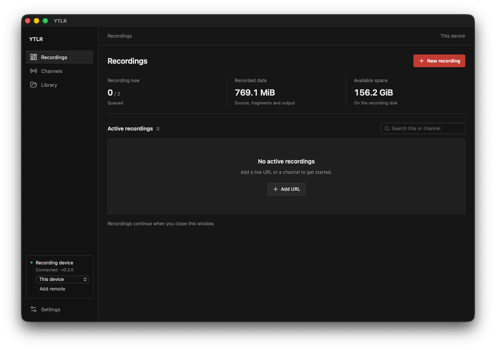
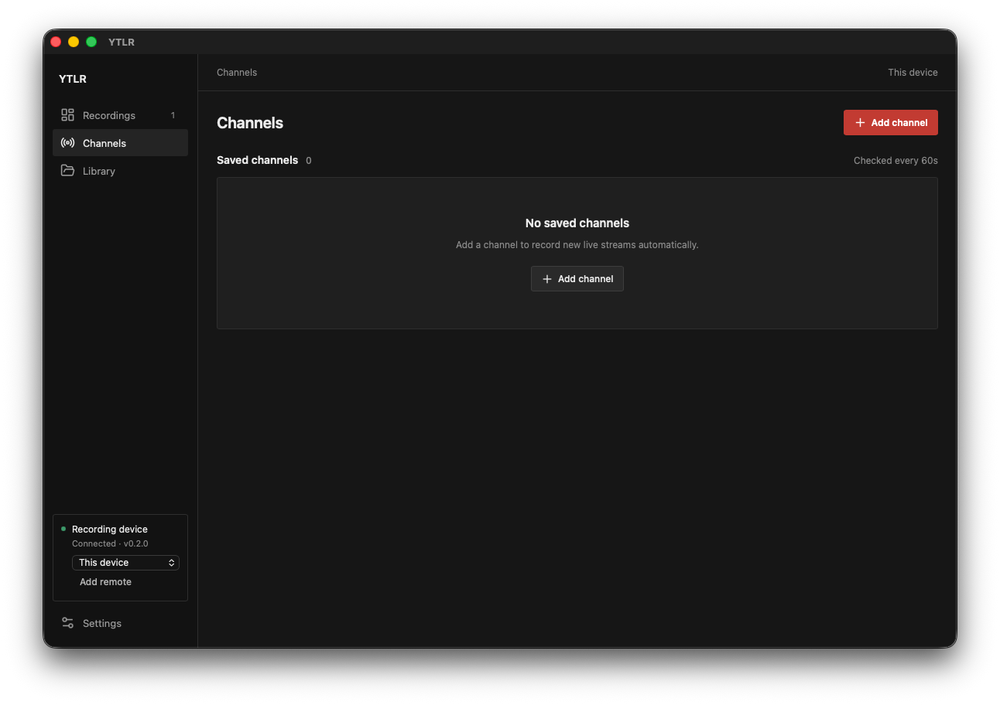
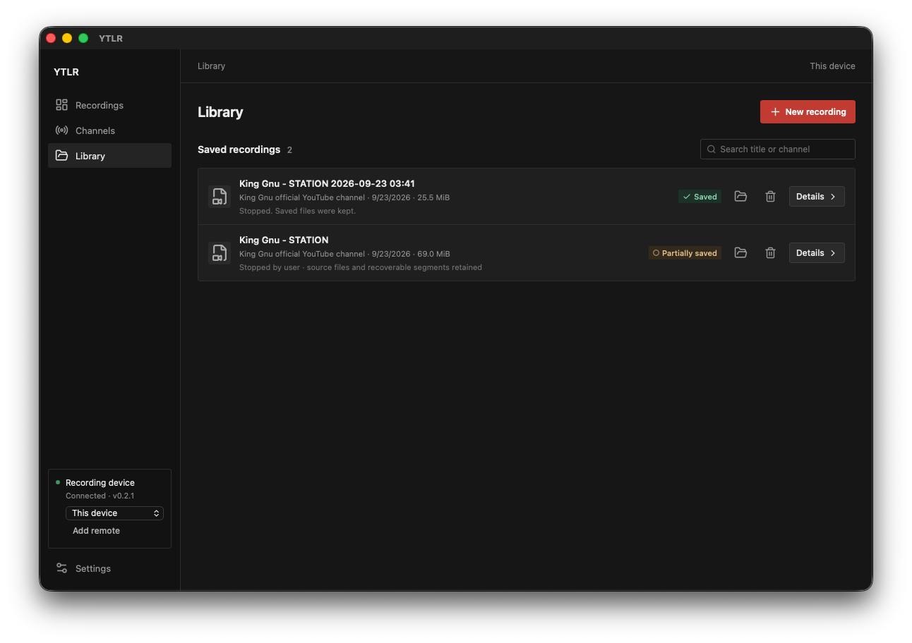

<div align="center">

# YTLR

Youtube Live Record

[](https://github.com/jeonjw85/ytlr/releases/latest)
[](https://github.com/jeonjw85/ytlr/actions/workflows/ci.yml)
[](LICENSE)

</div>

YTLR is a durable live-stream recording application for macOS, Linux, and
Windows. It keeps source media when a stream reconnects or a service is
restarted, and provides both a Tauri desktop app and a command-line client.

The project is currently at **0.2.2** and is in stabilization testing.

<p align="center">
  
</p>
<p align="center">
  
  
  
</p>

## Highlights

- Record a live URL, wait for a scheduled stream, or monitor a channel.
- Select the best stream available through `yt-dlp` and record without
  re-encoding through FFmpeg.
- Limit video to 1080p, 720p, or 480p, or record audio only. Save defaults
  per channel and retain each job's options across reconnects and restarts.
- Show disk capacity, recent recording write rate, estimated time to the
  free-space reserve, and early low-storage warnings.
- Preserve source fragments and 30-second MKV segments across reconnects.
- Detect reception stalls, record events, and expose diagnostic logs.
- Recover playable results from source tracks or completed segments.
- Export compatible results to MP4 without replacing the original files.
- Verify media containers and audio/video headers before marking a recording
  complete.
- Back up finalized source files to a separate disk or directory with SHA-256
  verification.
- Use Netscape `cookies.txt` and context-qualified PO Token files for streams
  that require them.
- Control a recording service over an authenticated SSH tunnel.
- Delete a completed or stopped job and its local recording folder from the
  desktop app's Library.

## Architecture

- **Recording service:** Rust service that owns jobs, storage, recovery, and
  background workers.
- **Desktop app:** Tauri 2 + React interface for recordings, channels, the
  Library, and settings.
- **CLI:** The same service can be controlled without a GUI, including on a
  Linux server.
- **Media tools:** `yt-dlp` selects streams and FFmpeg captures and validates
  media. Release bundles include the required tools.

## Requirements

- Rust stable
- Node.js 22 or newer
- pnpm 11
- macOS: Xcode Command Line Tools
- Linux: Tauri WebKitGTK 4.1 and the platform development libraries

## Development

```sh
pnpm install
pnpm dev
```

On the first run, open **Settings -> Install verified tools** to install
`yt-dlp`, Deno, FFmpeg, and `ffprobe`. Existing system tools are detected when
available.

Build the desktop frontend with:

```sh
pnpm build
```

Release bundles are written under `target/release/bundle/`. Code signing and
notarization require the distributor's own certificates; no signing keys are
included in this repository.

## CLI and Linux Server

Build the CLI without GUI dependencies:

```sh
cargo build --release -p ytlr
./target/release/ytlr tools install
./target/release/ytlr record 'https://www.youtube.com/watch?v=VIDEO_ID'
./target/release/ytlr record 'https://www.youtube.com/watch?v=VIDEO_ID' --from-now
./target/release/ytlr record 'https://www.youtube.com/watch?v=VIDEO_ID' --max-height 720
./target/release/ytlr record 'https://www.youtube.com/watch?v=VIDEO_ID' --audio-only
./target/release/ytlr record 'https://www.youtube.com/watch?v=VIDEO_ID' --for-minutes 120
./target/release/ytlr watch 'https://www.youtube.com/@CHANNEL'
./target/release/ytlr watch 'https://www.youtube.com/@CHANNEL' --audio-only
./target/release/ytlr channel configure CHANNEL_ID --max-height 480 --from-now
./target/release/ytlr status --json
./target/release/ytlr stop JOB_ID
./target/release/ytlr recover JOB_ID
./target/release/ytlr export JOB_ID --index 0
./target/release/ytlr events JOB_ID
./target/release/ytlr doctor
./target/release/ytlr schedule JOB_ID --stop-at '2026-10-01T23:30:00+09:00'
./target/release/ytlr schedule JOB_ID --clear
./target/release/ytlr bookmark add JOB_ID 'Concert starts' --note 'Opening song'
./target/release/ytlr bookmark list JOB_ID
./target/release/ytlr storage JOB_ID
./target/release/ytlr cleanup JOB_ID
# After reviewing the returned plan and files:
./target/release/ytlr cleanup JOB_ID --plan PLAN_ID --file attempt-0001/part-000000.mkv
```

Most commands start the service in the background when needed. Use
`ytlr run --headless` for a foreground process managed by systemd or launchd.
`ytlr shutdown` stops the service cleanly. Jobs that were not explicitly
stopped can resume on the next service start.

Use `--data-dir PATH` or `YTLR_HOME` to run an isolated data and service
instance. The macOS app bundle includes the CLI at
`YTLR.app/Contents/MacOS/ytlr`.

## Recording Semantics

The default is **Video + audio / Best quality**. In the desktop recording
dialog, choose **Maximum quality** to select the best available stream at or
below 1080p, 720p, or 480p. This selects a source stream rather than resizing
video. If no matching stream is available, the job reports an error and follows
the normal retry policy; it never silently exceeds the limit. The selected
stream's resolution/format is shown on the recording card and in its details.

**Audio only** requires an available audio-only stream and preserves its codec
without downloading video. Source recovery and verification expect audio only;
the export action creates a separate `.mka` file without re-encoding. Video
exports remain MP4. Audio-only mode and a maximum video height cannot be combined.

Channel recording options apply to newly created jobs. Editing a channel does
not change queued or running jobs. `channel configure` replaces the channel's
recording defaults: omitted quality/mode flags restore best-quality video,
and omitting both `--from-now` and `--from-start` uses the global start setting.
Remote replica requests carry the same recording options.

Recording from the current point is the default. The desktop option
**Save from the beginning when possible** enables yt-dlp's experimental
`--live-from-start` behavior. The platform can only provide past segments that
are still available.

The service keeps separate attempts after reconnects and never silently joins
uncertain boundaries. A user-stopped recording is shown as **Saved** when its
captured files are retained. **Partially saved** is reserved for missing or
unverified media continuity. A service interruption keeps source files and
queues the job for resumption.

The completion check covers container and audio/video headers and media length;
it does not prove that every moment of the public broadcast was available.

## Storage and Recovery

### Stop timers and bookmarks

Set a stop timer when adding a recording, or change/cancel it in the job's
details. Choose a duration **from now** (including time waiting for a stream)
or a specific time in the desktop's local timezone. The service stores an
absolute timestamp, checks it every two seconds, and uses the normal stop and
finalization flow. A deadline that passes while the service is down is honored
on restart; queued jobs do not start after an expired deadline. Finalization
can take additional time after capture stops. Manually retrying or recovering a job clears
its previous deadline. Replica requests include the deadline; edits propagate
on the next remote status check.

Use **Mark now** while receiving media to create a bookmark, then edit its
title and note in the job's details. Bookmarks persist with the job and retain
their capture-attempt number across reconnects. FFmpeg captures include the
latest reported media offset, which is approximate. Native from-start captures
retain wall-clock/receipt times but do not invent an unavailable media offset.
Opening a bookmark's attempt opens its result file; the external player is not
automatically seeked. The CLI also supports `bookmark edit` and `bookmark remove`.

### Recording health alerts

The service records persistent incidents for reception stalls, repeated
reconnections (three or more retries), recording/recovery failures, and remote
replica failures. It polls every five seconds, suppresses duplicate incidents,
and records their resolution. A retry by itself does not count as recovery:
reception-related alerts clear when fresh media arrives, or when the job ends.
The desktop shows active incidents and sends problem/cleared notifications
when notifications are enabled and permitted. System notifications require
the desktop app to be running; service-side incidents/events persist when it
is closed.

### Source preservation

Each job has its own directory:

```text
recordings/VIDEO_ID_JOB_ID/
├── attempt-0001/
│   ├── session.json
│   ├── durable-fragments.jsonl
│   ├── segments.csv / source.*-FragN
│   ├── part-*.mkv / source.*
│   └── result.json
├── attempt-0002/
└── recording.json
```

SQLite uses WAL mode and full synchronization. A job's source fragments,
segments, and finalized results are retained so recovery can be attempted
without overwriting an earlier attempt. This can require two to three times
the size of the final video.

Storage status refreshes every 10 seconds for the configured storage root and
roots used by unfinished jobs. The time estimate uses recent recording writes
over a roughly 30-second window and subtracts the configured free-space reserve.
It conservatively includes all concurrent recordings, even across separate
disks. No estimate is shown before samples are available or when writes stop.
Merging, recovery, exports, and other applications can consume additional space.

A warning appears when free space reaches the greater of 5 GiB or twice the
reserve, or the estimated time to the reserve is 30 minutes or less. The desktop
shows a persistent warning and sends a system notification when enabled and
permitted. The service also records warning events for affected unfinished jobs.
The existing free-space reserve continues to prevent starting or continuing
recordings below that threshold.

The **Recover source** action creates a playable result from available source
tracks or completed segments. It does not guarantee that unavailable network
media can be reconstructed.

### Library cleanup

The job details show space used by source tracks, fragments, segments, verified
results, exports, and metadata. **Preview cleanup** lists eligible files and
the results that will be retained. Select files and explicitly confirm deletion,
or use `cleanup JOB_ID --plan PLAN_ID --file RELATIVE_PATH` (repeat `--file` for
multiple files). `--all` explicitly selects all files in that preview.

Cleanup currently removes only closed FFmpeg segments covered by a verified
merged result, for completed/stopped jobs without uncertain continuity or gaps.
It retains native fragments, incomplete source files, verified results, and
exports. Result hashes, media tracks/durations, source ledgers, and candidate
hashes are checked again before deletion. A changed/stale preview is rejected.
Hashing large recordings can take time. Cleanup is serialized with finalization
and uses the same per-job lock as backup; a disconnected client does not abandon
an in-progress operation.

Cleanup receipts and original ledger snapshots are retained. The live ledger
is updated before deleting the selected files so subsequent recovery/backup
does not treat intentional removal as corruption. These audit files are also
backed up; existing backup copies are not deleted. If cleanup is interrupted,
remaining files stay on disk and a new preview can be generated.

## Backups and Remote Control

The backup destination must already exist. YTLR identifies the volume,
publishes a finalized file list only after every copy is verified, and repairs
same-size files whose hashes differ. Backup failures do not stop recording.

Remote control uses an SSH tunnel while keeping the server API bound to
localhost. Configure a remote with the CLI:

```sh
ytlr remote add studio \
  --ssh recorder@server \
  --remote-data-dir /home/recorder/ytlr-data \
  --executable /home/recorder/.local/bin/ytlr
ytlr --remote studio status
```

SSH key authentication and trusted host keys must be configured first. A
remote recording can be requested as a second capture target, but the two
results are not automatically merged.

## Testing

```sh
cargo fmt --all -- --check
cargo clippy --all-targets -- -D warnings
cargo test
pnpm check
pnpm test
pnpm test:integration
pnpm test:ui
pnpm test:remote
```

Long-running local HLS tests are available for failure injection and restart
validation:

```sh
pnpm test:soak --seconds 600
pnpm test:soak --seconds 86400
```

The CI workflows cover core and GUI builds on Linux and Windows. Public live
compatibility, 24- to 72-hour operation, power loss, physical disk failure,
and platform-specific signing still require field validation.

## License

The project code is MIT licensed. Bundled external tools have their own
licenses. See [THIRD_PARTY.md](THIRD_PARTY.md) for versions and sources.
